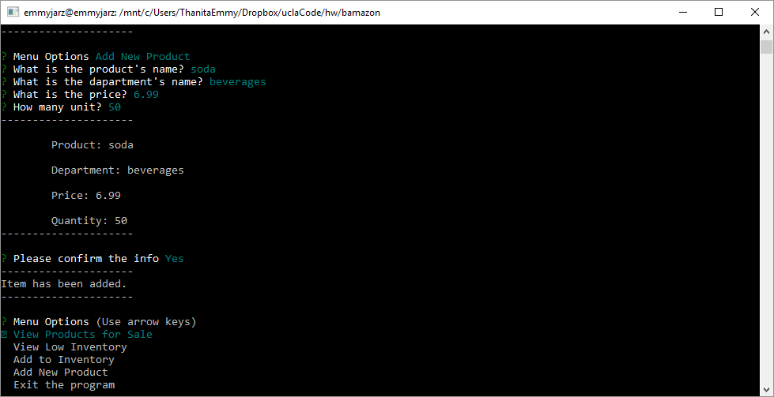

# bamazon
Bamazon is a store software management system which is designed for both customer and manager with node.js

## bamazonCustomer.js

Display all available products in the store, by inputting a product ID and quantity you can make a purchase. The program will notify if there is insufficient product and it will display your total.

## bamazonManager.js
### Display 4 options to choose from:

#### View Products for Sale

#### View Low Inventory

#### Add to Inventory

#### Add New Product

